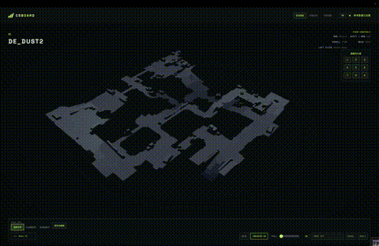
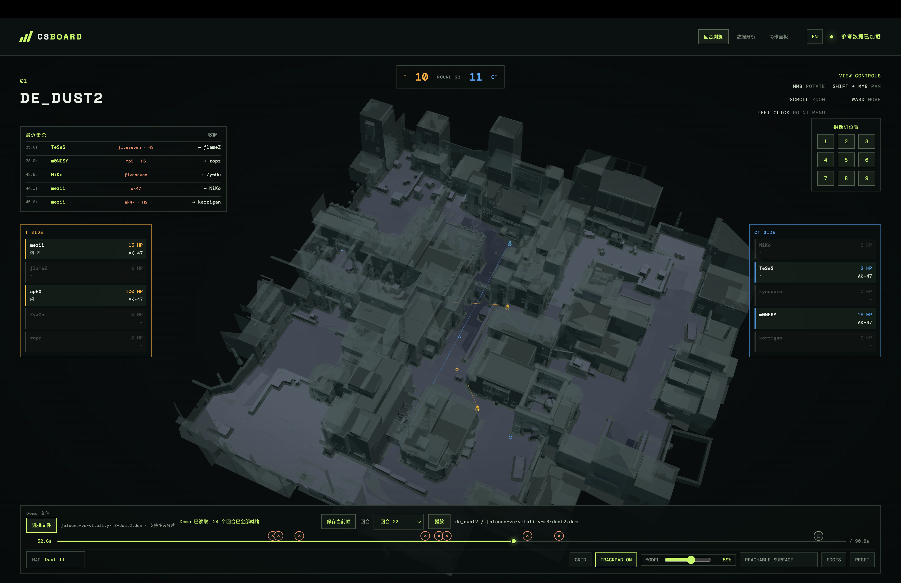
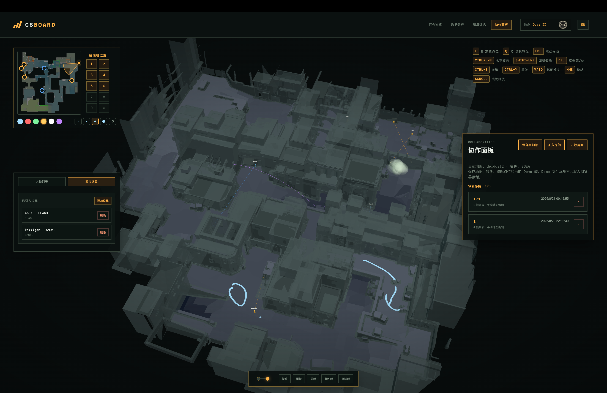
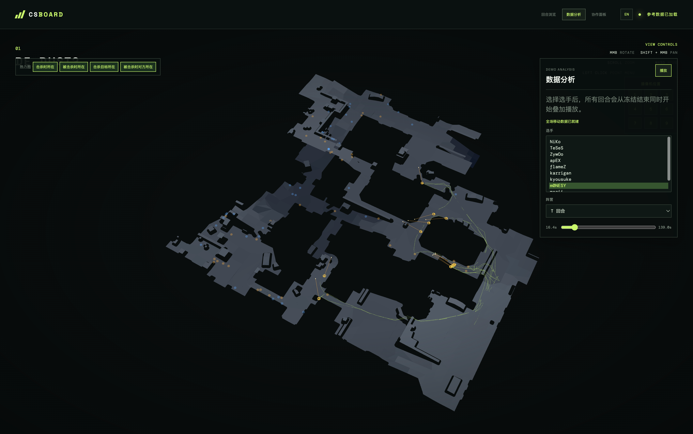

# CSBoard

> A 3D tactical board, CS2 Demo replay viewer, analysis workspace, and real-time collaboration tool.

[中文说明](README.zh-CN.md) · [Changelog](CHANGELOG.en.md)



CSBoard turns CS2 maps and Demo files into an interactive tactical workspace. It combines editing, round playback, player and utility visualization, event timelines, spatial analysis, local archives, and Yjs-powered collaboration in one browser application.

## Highlights

### Round Replay



- Import one Demo or select multiple Demo parts and merge them into one match.
- Parse playable rounds once through Rust/WASM, persist each round in IndexedDB, and switch rounds without reparsing the Demo.
- Omit empty placeholder rounds and discard incompatible cached parses automatically.
- Replay from freeze end with player movement, kills, deaths, weapons, health, utility, C4 state, and event markers.
- Display simplified standing and crouching player models with yaw, pitch, dynamic eye height, and BVH-accelerated line-of-sight collision.
- Track C4 carriers, drops, plants, explosions, defuses, approximate drop trajectories, and the bomb timer.
- Save the current frame and convert live players and active utility into editable tactical-board objects.

### Tactical Editing



- Place T or CT tactical points directly on surfaces (Collaboration panel only).
- Draw freehand brush strokes on the ground in round replay / analysis / utility panels, with undo/redo.
- Edit point team, symbol type, direction, aim length, and vertical angle.
- Place and adjust smoke, fire, flash, HE, and decoy effects.
- Open the custom utility wheel from any desktop workspace and delete placed utility with `Ctrl`/`Cmd` + click.
- Store ten camera presets per map and restore them with `1-9` / `0`.
- Save local workspace archives containing player markers, utility, brushes, camera presets, and an optional Demo frame reference.

### Utility Notes


- Save map-specific utility setups from pasted `getpos` output or Demo throws.
- Search and replay saved lineups with setup positions, view angles, thrower details, events, and projectile paths.
- Edit utility titles and descriptions without rebuilding the record.
- Export the utility library as JSON and append imported JSON records to the local library.
- Deduplicate records by complete deep equality during import; identical records are retained only once.
- Import a saved utility into a collaboration frame only after selecting it and confirming the action. Imported utility and custom `Q`-wheel utility remain separate data types.

### Demo Analysis



- Select one or more players and overlay movement from every round starting at freeze end.
- Filter analysis by all rounds, T-side rounds, or CT-side rounds.
- Inspect synchronized movement paths and aggregated spatial heatmaps.
- Visualize killer positions, victim positions, target positions, and opposing-player positions at kill time.

### Collaboration


- Create or join a six-character Yjs WebSocket room.
- Synchronize player markers, imported utility, custom utility, brushes, frame order, and active frames.
- Player markers carry a character model and AK47 and use generated adjective-fruit names; drag to move, use `Ctrl` to adjust yaw, `Shift` to adjust pitch, and double-click to toggle crouch/stand.
- Frames contain players, imported utility, custom utility, trajectories, and brushes. Camera state and camera presets remain archive-level data.
- Insert, duplicate, delete, save, and switch frames. Saving to an existing archive appends a frame; switching smoothly transitions same-name player positions, yaw, and pitch.
- Use unified undo/redo for players, utility, brushes, imported utility, and erasing. History is isolated per frame.
- Let room members edit shared tactical content while keeping the current camera private.
- Show room members, owner/current-user labels, and recent join/leave activity; support owner-controlled room destruction.
- Use local archives as reusable starting points for collaborative sessions.

### Map Rendering

- Load CS2 data for supported maps (from cloud storage, parsed in the browser) and constrain tactical editing to reachable surfaces.
- Render GLB map geometry loaded from cloud storage with configurable opacity.
- Switch between reachable-surface, mouse-lens, and camera-lens model views.
- Show Nuke and Vertigo as full, upper, or lower 3D floors. Switch from either the radar preview or the camera-bar `UP` / `LOW` controls; players, utility, trajectories, and manual editing follow the active floor.
- Use `three-mesh-bvh` for efficient nearest-wall line-of-sight queries.
- Report GLB download/processing failures and retain NAV-based camera framing, collision, and surface editing when a model is unavailable.
- Show bundled 2D radar previews and floor switching where map assets provide them.
- Navigate with Blender-style mouse controls, trackpad gestures, and WASD movement.

### Interface

- Switch the application between English and Chinese at runtime.
- Inspect live T/CT rosters, score, health, active weapons, remaining utility, deaths, and C4 ownership.
- Jump directly to kills, C4 plants, explosions, and round-end events from the timeline.
- Keep desktop tool panels in dedicated columns around the 3D viewport and collapse available sidebars independently.
- Offer a non-blocking replay-control prompt when the loaded Demo map differs from the current map.

### Mobile / H5


- Use a dedicated mobile layout with a 4:3 Three.js viewport above the operation panels.
- Rotate with one finger; use two fingers to zoom and pan.
- Select camera presets from a cyclic iPhone-style semicircular dial overlaid on the bottom of the 3D viewport.
- Tap a saved camera position to restore it, rotate through positions continuously, swipe up to save the centered slot, or select `RESET`.
- Keep collaboration frames at the top of the operation area for quick switching.
- Hide Round Replay, Demo Analysis, map controls, brush controls, trackpad settings, and model-lens modes on H5. Utility Notes and Collaboration remain available.

## Supported Maps

The repository includes files for:

- Ancient
- Anubis
- Cache
- Dust II
- Inferno
- Mirage
- Nuke
- Overpass
- Train
- Vertigo

GLB map models are intentionally not committed. Run `make resources` when local `.nav`/`.glb` files are needed under `public/maps/<map>/`; the Workers application loads production map resources from cloud storage.

## Getting Started

Requirements:

- Node.js 20 or newer
- npm

Install dependencies:

```bash
npm install
cp .env.example .env.local
```

Set your own `VITE_OSS_BASE_URL` in `.env.local`, then run `make resources` to download missing local maps. `MAP_DOWNLOAD_BASE_URL` can override the source for that command only; the repository does not provide a default download origin.

Build the frontend and start the APIs and collaboration service with the default Node.js Runtime:

```bash
npm run dev
```

The default development command starts the traditional Node.js HTTP/WebSocket adapter on port `3001`. Run `make workers-dev` or `npm run dev:workers` when testing the Cloudflare Workers Runtime and Durable Objects integration; this also starts a local map server on port `3002` so NAV/GLB requests continue to use `public/maps`. Run `make help` for the main setup, resource, frontend, backend, and Workers commands.

The same API and Yjs protocol core can also run behind a traditional Node.js HTTP/WebSocket entry:

```bash
make node-dev
# or: npm run dev:node
```

The Node.js Runtime adapter listens on `PORT` (default `3001`) and reads `MAP_BASE_URL` from `process.env`. The Cloudflare Workers adapter uses `env.MAP_BASE_URL` and Durable Object Storage; shared route, parsing, and protocol logic lives under `server/core/`.

Build the production bundle:

```bash
make build
```

This creates the frontend in `dist/`, validates the Node.js Runtime adapter, and writes the Cloudflare Workers bundle to `build/workers/`. Make builds derive the header version from Git: a clean exact-tag build uses that tag, while dirty or untagged interactive builds ask before using `git describe`.

`npm run build` and `npm run build:local` use local `/maps` resources and same-origin APIs. `npm run build:remote` uses `VITE_OSS_BASE_URL` and `VITE_BACKEND_BASE_URL`; the frontend Worker invokes this remote build.

## Controls

| Input | Action |
| --- | --- |
| Middle mouse drag | Rotate camera |
| `Shift` + middle mouse | Pan camera |
| Mouse wheel / trackpad gesture | Zoom or orbit |
| `W A S D` | Move camera |
| Left drag (round replay / analysis / utility) | Draw a freehand brush stroke on the ground |
| `Ctrl+Z` / `Ctrl+Shift+Z` / `Ctrl+Y` | Undo / redo brush strokes |
| `E` | Place a tactical point (Collaboration panel only) |
| `Ctrl` + left drag | Erase brush strokes, or adjust a player marker's yaw |
| `Ctrl` / `Cmd` + click placed utility | Delete the placed utility |
| `Shift` + left drag a player | Adjust player pitch |
| `Q` | Open the custom utility wheel in the active desktop workspace |
| Left click a point | Open the point editor |
| `Ctrl` + `1-9` / `0` | Save one of ten camera presets |
| `1-9` / `0` | Restore a camera preset |
| `Space` | Play or pause replay/analysis |
| `←` / `→` | Step replay or analysis by 16 ticks; switch adjacent Collaboration frames |
| Mobile one-finger drag | Rotate camera |
| Mobile two-finger gesture | Zoom and pan camera |
| Mobile camera-dial swipe | Rotate through camera slots; swipe up to save the centered slot |

## Resource Layout

```text
assets/
  readme/                 # README screenshots and demonstration GIF
public/
  maps/
    <map>/
      <map>.nav           # local dev data, ignored by Git (auto-downloaded on dev)
      <map>.glb           # local dev data, ignored by Git (auto-downloaded on dev)
```

The whole `public/` directory is ignored by Git. Running `make resources` checks each map and downloads missing files from `VITE_OSS_BASE_URL` (or `MAP_DOWNLOAD_BASE_URL`) configured in `.env.local`. The command fails clearly when no download origin is configured.

Local builds load NAV and GLB from `public/maps` (`/maps/<map>/<map>.nav`, `/maps/<map>/<map>.glb`). Remote builds use cloud storage:

- `<VITE_OSS_BASE_URL>/maps/<map>/<map>.nav`
- `<VITE_OSS_BASE_URL>/maps/<map>/<map>.glb`

NAV files are fetched as raw bytes and parsed in the browser (`src/navParser.js`). The bucket must send `Access-Control-Allow-Origin` headers. The legacy `/api/maps/:map/nav` endpoint remains as a fallback but is not required at runtime.

Map extraction tools and raw game resources remain local-only. Do not commit VPK files, extracted game assets, Demo files, or GLB models.

## Architecture

- React and Vite for the application shell and UI.
- Three.js for map rendering, tactical objects, effects, and replay visualization.
- Rust/WASM `demoparser2` for Demo events, ticks, players, inventory, and projectiles.
- `three-mesh-bvh` for accelerated map raycasting.
- Yjs and `y-websocket` for collaborative rooms.
- Cloudflare Workers Fetch API for HTTP routes in the backend Worker and static assets in the frontend Worker.
- Cloudflare Durable Objects for room WebSockets and short-lived Yjs persistence.

## Cloudflare Workers

The production backend is a Workers module exported from `server/index.js`; it does not open a local port. A separate frontend Worker serves `dist` through Workers Static Assets, while the backend routes `/rooms/<code>` to one Durable Object per room.

```bash
npm install
npx wrangler dev
cp deploy.cloudflare.env.example deploy.cloudflare.env
make workers-deploy
```

Edit `deploy.cloudflare.env` with the Cloudflare account, frontend and backend Worker names, OSS base URL, backend public URL, and optional custom domains. Prefer supplying `CLOUDFLARE_API_TOKEN` through the shell or CI secret store. The deploy script writes the platform-neutral `VITE_OSS_BASE_URL` and `VITE_BACKEND_BASE_URL` values to the ignored `.env.production.local`, then passes the same OSS base URL to the backend as `env.MAP_BASE_URL`.

The script deploys the API, room WebSockets, and Durable Objects to the backend Worker first, then deploys the Vite bundle to the frontend Workers Static Assets service. `BACKEND_PUBLIC_URL` is embedded into the frontend so collaboration connections use the separate backend origin.

The legacy `POST /api/parse` response contract is retained using the existing browser-compatible parser WASM. Cloudflare request-body, memory, and CPU limits still apply, so large Demo files should continue to be parsed locally in the browser.

The native `@laihoe/demoparser2` package is used only by the Node.js Runtime adapter and offline tools. It is not imported by or bundled into Cloudflare Workers because the runtime cannot load N-API addons or start subprocesses; the Cloudflare Workers adapter uses the existing parser WASM instead.

## Current Limitations

- Node.js Runtime rooms are held in process memory. Cloudflare Workers rooms use Durable Object storage and are deleted five minutes after the final client disconnects.
- Room ownership is currently client-managed rather than protected by a server-issued owner token.
- The parser does not expose per-Tick C4 entity coordinates, so dropped-C4 motion is approximated between events.
- Production loads map NAV and GLB from cloud storage; development uses local files under `public/maps/` (auto-downloaded when missing).
- Large Demo files can require significant memory because all round snapshots are cached after the initial parse.
- Round Replay and Demo Analysis are desktop-only; H5 exposes Utility Notes and Collaboration.

## Roadmap

### Model Size Reduction

- Reduce map model asset size, download cost, and runtime memory usage.

### Map Area Markers

- Mark C4 bombsites and team spawn areas on supported maps.
