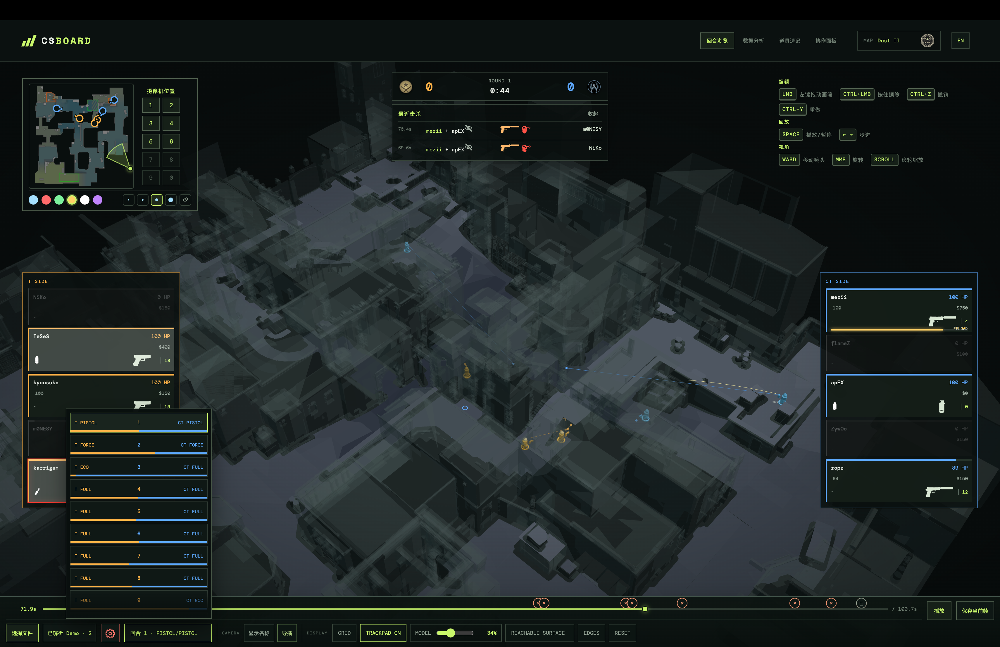
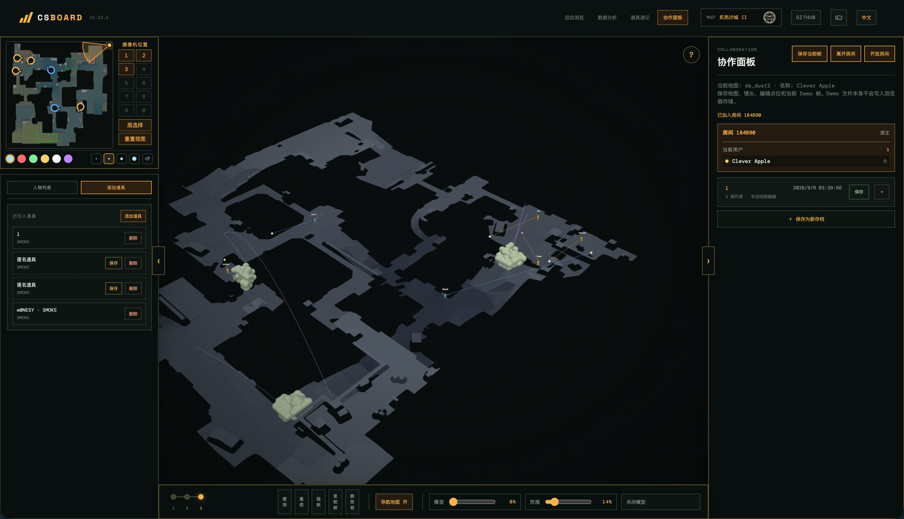
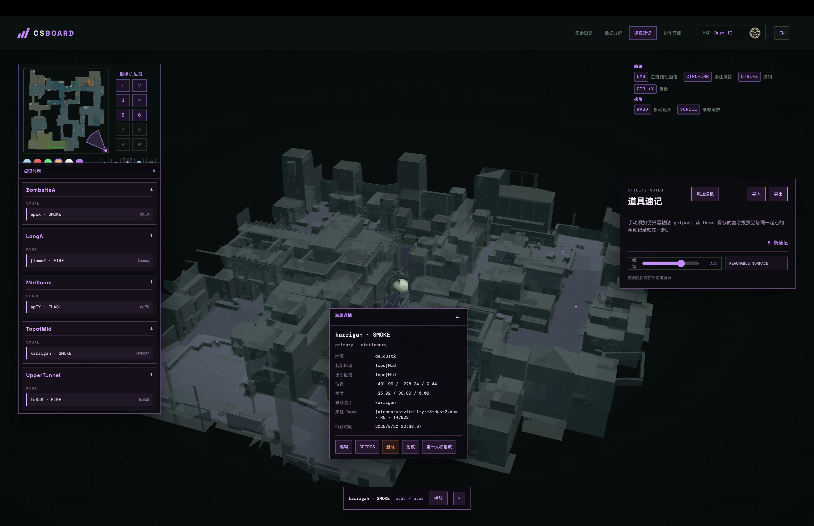
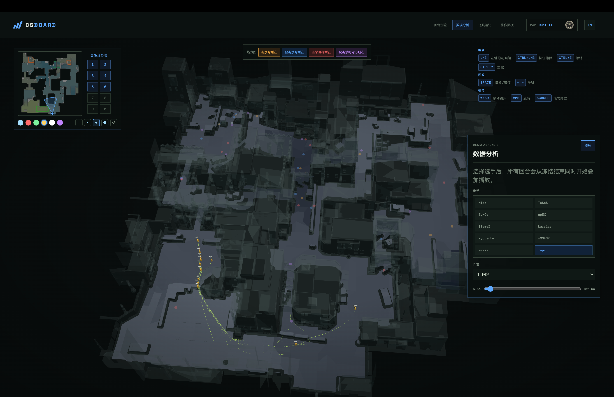
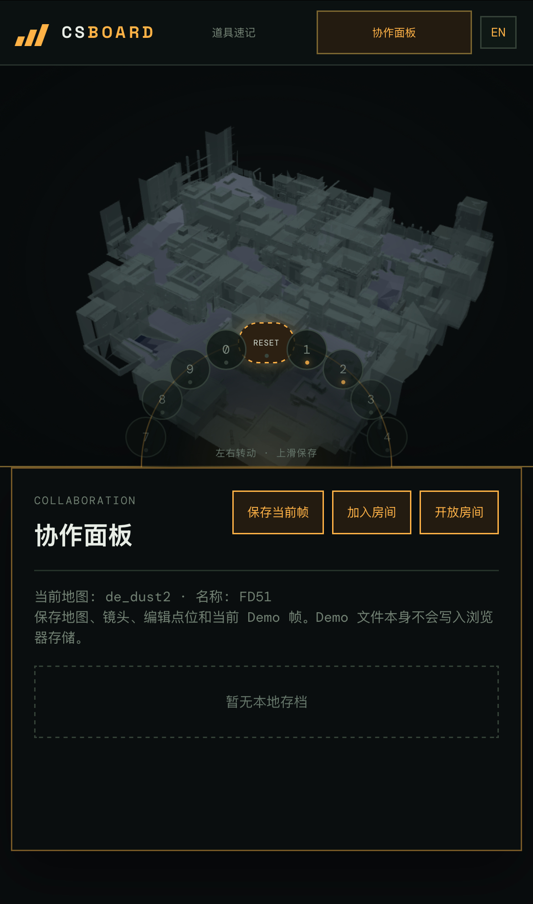

# CSBoard

> 集 3D 战术板、CS2 Demo 回放、数据分析和实时协作于一体的浏览器工具。

[English](../README.md) · [Русский](README.ru-RU.md) · [更新日志](CHANGELOG.zh-CN.md)


CSBoard 将 CS2 地图与 Demo 文件转换成可交互的战术工作区，在同一个应用中提供战术编辑、回合回放、玩家与道具可视化、事件时间轴、空间分析、本地存档以及基于 Yjs 的多人协作。

## 1.15.0 版本

- 回合浏览可保存命名时间段，用于视角演播；选择存档即可开放房间，访客下载后保存到本地。
- 监视器支持同阵营多视角、阵营切换与死亡遮罩。
- 协作面板、视角演播和道具速记支持可拖拽的文件夹树；烟雾改为更连贯的体积效果，奔跑尾迹不再因小范围往返移动堆积。
- Cloudflare Worker 前端可选用本地 SVG 图标资源包；击杀栏也能识别带附加后缀的 Demo 武器名。
- 详见[版本记录](CHANGELOG.zh-CN.md)与[第三方鸣谢及许可证](../THIRD_PARTY_NOTICES.md)。

## 主要功能

### 回合浏览



- 导入单个 Demo，或多选 Demo 分片并合并为一场比赛。
- 通过 Rust/WASM 一次性解析全部可播放回合，将各回合持久化到 IndexedDB，之后无需重新解析 Demo 即可切换。
- 自动忽略空的占位回合，并丢弃不兼容的旧解析缓存。
- 从冻结结束开始回放玩家移动、击杀、死亡、武器、血量、道具、C4 状态和事件标记。
- 使用简化的站立/蹲伏人物模型，并显示 yaw、pitch、动态视点高度和 BVH 加速的视线墙体碰撞。
- 跟踪 C4 携带、掉落、安装、爆炸、拆除、近似掉落轨迹和炸弹倒计时。
- 保存当前帧，将当前玩家和生效道具转换成可编辑的战术板对象。
- 可切换同阵营监视器墙，选择主视角；阵亡队友的画面会变黑。
- 可将命名时间段保存为视角演播片段。

### 视角演播

- 播放单个已存时间段，不展示比分、击杀栏与回合控制；保留监视器、模型选项和点击道具保存。
- 选择片段即开放六位房间号；访客先查看全屏下载进度，存到本地后再播放。
- 与回合浏览分别保留播放进度、镜头和主视角，切换页面不混用状态。

### 战术编辑



- 放置 T 或 CT 战术点（仅限协作面板）。
- 在回合浏览/数据分析/道具速查面板左键拖拽绘制手绘笔迹，支持撤销与重做。
- 编辑点位阵营、符号类型、方向、视线长度和垂直倾角。
- 放置和调整烟、火、闪、HE 与诱饵弹效果。
- 在任意桌面工作区打开自定义道具轮盘，并使用 `Ctrl`/`Command` + 点击删除已放置道具。
- 每张地图保存 10 个镜头预设，并通过 `1-9` / `0` 快速恢复。
- 本地存档可保存人物、道具、画笔、镜头预设和可选的 Demo 当前帧引用。
- 本地存档可通过文件夹树拖拽整理；删除文件夹会将条目上移，不删除存档。

### 道具速记



- 可通过粘贴 `getpos` 输出或从 Demo 投掷中保存地图专属道具记录。
- 支持搜索和重播站位、视角、投掷者、事件及投掷物轨迹。
- 可直接编辑道具标题和描述。
- 支持将道具库导出为 JSON，也可将 JSON 数据附加导入本地道具库。
- 导入时按整条记录深度比较，完全相同的数据只保留一条。
- 向协作帧引入道具时，必须先选择并确认；引入道具与 `Q` 轮盘创建的自定义道具保持两套独立数据逻辑。
- 道具记录可独立按文件夹拖拽整理。

### 数据分析



- 进入数据分析页面后再懒加载分析正文、选手汇总和逐回合道具轨迹；支持按前缀、包含关系或字符顺序模糊搜索并多选选手，以彩色标签展示选中项，并明确展示加载状态。
- 从任一已选选手可用的 Demo 中选择最近或指定记录，并按全部回合、T/CT 方及每名选手自身/对方的经济类型筛选。
- 在区域时间、KD 事件和道具事件之间切换，同时保留共用的路径播放、时间进度条和步进控制。
- 区域时间可组合查看开局前期、中期和下包后；默认以冻结结束后 30 秒为前期/中期分界，也可在 10–90 秒间自行调整。
- KD 事件可分别展示击杀者、死亡者、目标和交战对手的位置。
- 道具事件可按烟、闪、火、HE 和诱饵弹筛选；位置模式显示不同形状的出手点、彩色落点与完整轨迹，热力模式只统计落点。
- 相近的道具落点保持独立，并通过 hover 列表选择；点击落点可将完整投掷记录保存到道具速记。
- 热力图按 NAV 高度分层以避免多层地图串层，并提供 2–24 米平面扩散范围调节；拖动结束后才重新计算。

### 多人协作


- 创建或加入 6 位房间号的 Yjs WebSocket 房间。
- 同步人物、引入道具、自定义道具、画笔、帧顺序和当前帧。
- 人物点带人物模型和 AK47，并使用自动生成的“形容词 + 水果”名称；可拖动移动，使用 `Ctrl` 调整 yaw、`Shift` 调整 pitch，双击切换蹲下/站立，并可在人物列表中直接选择 `T` 或 `CT` 阵营。
- 每帧包含人物、引入道具、自定义道具、轨迹和画笔；当前相机与镜头预设属于存档级数据，不属于单帧。
- 支持插帧、复制、删除、保存和切换；保存到已有存档会追加一帧，切帧时同名人物的位置、yaw 和 pitch 平滑过渡。
- 人物、道具、画笔、引入和擦除共用统一撤销/重做，并按帧隔离历史。
- 房间成员可以共同编辑战术内容，同时各自当前摄像机保持私有。
- 显示房间成员、房主/自己标记和最近加入/离开动态，并支持房主销毁房间。
- 可使用本地存档快速创建协作战术板。

### 地图渲染

- 从云存储加载受支持地图的 CS2 数据（在浏览器内解析），并限制编辑内容落在可达表面。
- 从云存储加载 GLB 地图模型并调节透明度；启用“层选择”后，模型在地图轴对齐正方形边界外 50 游戏单位开始淡出，经过 20 单位后完全透明。
- 支持鼠标透镜和镜头透视两种模型显示方式，默认使用镜头透视。
- Nuke、Train、Vertigo 与 Training Ground 支持完整、高层和低层的 NAV 顶底二值区间裁切；其他地图也可启用或取消单层可玩区间，以移除遮挡视野的屋顶模型。人物、道具、轨迹和人工编辑会遵循当前区间。
- 使用 `three-mesh-bvh` 高效查询视线最近墙体碰撞。
- 显示 GLB 下载、处理和失败状态；模型不可用时继续使用 NAV 完成镜头取景、碰撞和表面编辑。
- 直接从内置 NAV 几何生成 2D 顶视图，多层地图同步提供上下层视图。
- 支持 Blender 风格鼠标控制、触控板手势和 WASD 移动。

### 界面信息

- 运行时切换中文、英文和俄文界面。
- 查看实时 T/CT 比分、成员、血量、当前武器、剩余道具、死亡状态和 C4 携带者。
- 从时间轴直接跳转到击杀、C4 安装、爆炸和回合结束事件。
- 桌面端使用独立列放置功能面板，避免覆盖 3D 视窗，并可分别折叠可用侧栏。
- Demo 地图与当前地图不一致时，在回放控制栏提供非强制跳转提示。
- 主要纵向滚动面板和列表会在仍有内容的方向显示黑色渐变提示，到达顶部或底部后自动隐藏。

### 手机 / H5



- 使用独立移动端布局：上方为 4:3 Three.js 视窗，下方为操作面板。
- 单指拖动旋转镜头，双指支持缩放与平移。
- 3D 视窗底部覆盖可循环转动的 iPhone 相机风格半圆机位轮盘。
- 可点按已保存机位恢复视角、循环转动选择机位、上滑保存中心机位，也可选择 `RESET`。
- 协作帧列表位于操作区顶部并支持吸顶，方便快速切换。
- H5 隐藏回合浏览、数据分析、地图工具、画笔工具、触控板设置和模型透镜模式，仅保留道具速记与协作功能。

## 支持地图

仓库内包含以下地图的文件：

- Training Ground（内置双层田字型教学地图，下层缓坡街道、上层屋顶连桥，无需外部资源）
- Ancient
- Anubis
- Cache
- Dust II
- Inferno
- Mirage
- Nuke
- Overpass
- Train
- Vertigo

所有支持地图的 NAV 解析数据均已提交并构建进前端，可离线使用。GLB 地图模型不会提交到仓库；需要本地源 `.nav` 与 `.glb` 时运行 `make resources` 下载到 `.local/official/maps/<map>/`。远程网页构建从云存储加载 GLB；本地和 Docker 使用本地模型，Electron 正式版由用户导入模型，不自动从 OSS 下载。

Training Ground 仅在道具速记和协作面板中提供；切换到回合浏览或数据分析时会自动返回 Dust II。

首次访问会询问是否进入教学，确认后直接打开 Training Ground 的协作练习帧。为方便本地调试，Vite DEV 或 `localhost`、`127.0.0.1`、`::1` 环境每第 3 次访问会重复显示提醒，弹窗底部也会注明该触发条件。教学地图提供同步的上层与下层 NAV 顶视图。

## 开始使用

环境要求：

- Node.js 20 或更高版本
- npm

安装依赖：

```bash
npm install
cp .env.example .env.local
```

在 `.env.local` 中填写你自己的 `VITE_OSS_BASE_URL`，然后运行 `make resources` 下载缺失的本地地图。也可以仅为下载命令设置 `MAP_DOWNLOAD_BASE_URL`；仓库不提供默认下载源。

构建前端，并通过默认 Node.js Runtime 启动 API 与协作服务：

```bash
npm run dev
```

默认开发命令会在 `3001` 端口启动传统 Node.js HTTP/WebSocket 适配层。需要测试 Cloudflare Workers Runtime 和 Durable Objects 集成时，使用 `make workers-dev` 或 `npm run dev:workers`；该命令还会在 `3002` 端口启动本地地图服务，为前端提供 `.local/official/maps` 中的 GLB。运行 `make help` 可查看安装、资源、前端、后端和 Workers 的主要命令。

相同的 API 与 Yjs 协议核心也可以通过传统 Node.js HTTP/WebSocket 入口运行：

```bash
make node-dev
# 或：npm run dev:node
```

Node.js Runtime 适配层监听 `PORT`（默认 `3001`），并从 `process.env` 读取 `MAP_BASE_URL`。Cloudflare Workers 适配层使用 `env.MAP_BASE_URL` 和 Durable Object Storage；共享路由、解析和协议逻辑位于 `server/core/`。

构建生产版本：

```bash
make build
```

该命令会将前端构建到 `dist/`、校验 Node.js Runtime 适配层，并将 Cloudflare Workers bundle 输出到 `build/workers/`。Make 构建会从 Git 生成标题栏版本：干净且 HEAD 有精确 tag 时使用该 tag；dirty 或无 tag 的交互构建会先询问，再使用 `git describe`。

`npm run build` 与 `npm run build:local` 使用本地 `/maps` 和同源 API；`npm run build:remote` 使用 `VITE_OSS_BASE_URL` 与 `VITE_BACKEND_BASE_URL`，前端 Worker 会调用该远程构建。

Electron 正式版使用 `npm run desktop:build:mac` 或 `npm run desktop:build:win` 构建，不携带地图模型。用户可从右上角“资源包”多选 SVG 图标和 GLB 模型导入，支持分批补齐及逐文件完整度检测；缺失图标沿用默认 UI，缺失模型使用 NAV 并隐藏模型操作，不自动访问 OSS。导入文件保存在应用用户数据目录，同名文件仅在验证通过后覆盖。先保存工作，再点击“重新加载并应用”。详见[资源包说明](resource-packs.md)。

未打包的开发启动可读取 `.local/official/maps`；`npm run desktop:build:local` 专门构建带本地模型的测试包。正式构建不包含 `.local/official` 或 `.local/official/maps`；网页版保留现有本地/OSS 模型逻辑。

Electron 前端还内置了可选启用的实验性 WebMCP 桥接。先执行一次 `npm run build:desktop`，再用 `npm run desktop:start:webmcp` 启用实验 API 支持，工具是否注册成功及模型是否连接仍需实际调用验证；普通的 `npm run desktop:start` 不会开启 Chromium 实验性 Web 平台开关。在数据分析页，接入的用户模型应先调用 `get_analysis_context` 读取当前筛选、字段说明、就绪状态和基础提示词，再通过 `get_filtered_analysis_data` 分页取得已经过滤的 KD、区域时间或道具 JSON；每页最多 200 条，道具轨迹按需开启，以免无谓占用模型上下文。支持视觉的模型还可调用 `capture_3d_view` 获取当前 3D 画布及相机和分析上下文；可调整宽高、WebP／JPEG／PNG 格式、质量、适配方式与是否附带上下文，默认输出紧凑的 960px 宽 WebP。两种模式都使用固定、只读的 `http://127.0.0.1:32145` 应用源，因此桌面端存储可跨启动保持稳定；仅在必要时通过 `CSBOARD_DESKTOP_PORT` 覆盖端口。

通过 Docker 运行 Node.js Runtime 时，将 GLB 放到 `.local/official/maps/<map>/` 后执行 `make docker`。Compose 会把该目录只读挂载到 `/app/.local/official/maps`；只有需要覆盖镜像默认的 `v1.15.0` 版本时才需设置 `BUILD_VERSION`。

## 操作方式

| 输入 | 操作 |
| --- | --- |
| 中键拖动 | 旋转镜头 |
| `Shift` + 中键 | 平移镜头，指针越过视口边缘时像 Blender 一样从反侧出现 |
| 鼠标滚轮 / 触控板手势 | 缩放或环绕 |
| `W A S D` | 移动镜头 |
| 左键拖拽（回合浏览/数据分析/道具速查） | 在地面绘制手绘笔迹 |
| `Ctrl+Z` / `Ctrl+Shift+Z` / `Ctrl+Y` | 撤销 / 重做画笔笔迹 |
| `E` | 放置战术点（仅协作面板） |
| `Ctrl` + 左键拖动 | 擦除画笔笔迹，或调整人物 yaw |
| `Ctrl` / `Command` + 点击已放置道具 | 删除该道具 |
| `Shift` + 左键拖动人物 | 调整人物 pitch |
| `Q` | 在当前桌面工作区打开自定义道具轮盘 |
| 左键点击点位 | 打开点位编辑器 |
| `Ctrl` + `1-9` / `0` | 保存 10 个镜头预设之一 |
| `1-9` / `0` | 恢复镜头预设 |
| `Space` | 播放或暂停回放/分析 |
| `←` / `→` | 回放或分析步进 16 ticks；切换相邻协作帧 |
| 手机单指拖动 | 旋转镜头 |
| 手机双指手势 | 缩放并平移镜头 |
| 手机机位轮盘滑动 | 循环选择机位；上滑保存中心机位 |

## 资源结构

```text
assets/
  readme/                 # README 截图与演示 GIF
src/
  data/nav/               # 由脚本生成并提交、由 Vite 构建的 NAV JSON
  default-data/           # 首次访问时导入的可提交默认数据
    utility-notes/        # 道具速记 JSON
    workspace-archives/   # 协作面板存档 JSON
.local/
  official/               # 游戏来源素材，包含提取与转换后的资源
    maps/<map>/           # NAV 源文件和 GLB 模型
    ui/                   # 资源包测试 SVG
    vpk/                  # 原始归档与解包输出
  dem/                    # 按平台分类的 Demo 样本
  previews/               # 生成的预览和本地检查
```

贡献者可将默认道具速记或协作存档 JSON 直接放入 `src/default-data/` 对应子目录，具体格式见 [`src/default-data/README.md`](../src/default-data/README.md)。这些文件只会在浏览器从未创建对应本地数据时导入，不会覆盖或重新填充现有用户数据。

运行 `make resources` 时，`scripts/ensure-maps.js` 会检测本地地图源文件与模型，并从 `.env.local` 的 `VITE_OSS_BASE_URL`（或 `MAP_DOWNLOAD_BASE_URL`）下载缺失文件。未配置下载源时命令会明确报错。替换源 NAV 后，运行 `make nav-data` 重新生成需要提交的前端数据。

NAV JSON 会直接包含在前端 bundle 中，并只在选中对应地图时解析；浏览器不会在运行时请求 NAV。本地构建通过 `/maps/<map>/<map>.glb` 从 `.local/official/maps` 加载 GLB，远程构建使用：

- `<VITE_OSS_BASE_URL>/maps/<map>/<map>.glb`

GLB 存储桶需返回 `Access-Control-Allow-Origin` 头。`src/navParser.js` 仅保留给构建期 NAV 生成脚本使用，不再暴露运行时解析接口。

地图导出工具和原始游戏资源继续仅保存在本地。请勿提交 VPK、解包后的游戏资源、Demo 文件或 GLB 模型。

## 技术架构

代码位置、数据流与验证方式见[开发导览](development.md)。

- React 与 Vite：应用外壳和界面。
- `src/analysis/` 收纳分析组件与计算逻辑，`src/demo/` 放置 Demo 领域逻辑和 HUD，`src/components/` 放置共享 UI，`src/three/` 放置 Three.js 辅助模块，`src/utility/` 放置道具速记逻辑，`src/hooks/` 放置跨面板 DOM 行为。
- Three.js：地图、战术对象、效果和回放渲染。
- Rust/WASM `demoparser2`：解析 Demo 事件、Tick、玩家、库存和投掷物。
- `three-mesh-bvh`：地图射线检测加速。
- Yjs 与 `y-websocket`：协作房间协议。
- Node.js Runtime：传统 HTTP/WebSocket 服务入口。
- Cloudflare Workers Fetch API：后端 Worker 提供 HTTP 路由，前端 Worker 提供静态资源。
- Durable Objects：云端房间 WebSocket 与短期 Yjs 持久化。

## Cloudflare Workers 部署

Wrangler 配置统一放在 [`config/cloudflare/`](../config/cloudflare/README.md)：`wrangler.dev.jsonc` 用于本地开发，另两份分别用于前后端部署。请使用项目命令启动，不再直接运行不带配置路径的 `wrangler dev`；开发脚本会继续使用根目录 `.wrangler/state`，无需迁移现有状态。

```bash
npm install
cp deploy.cloudflare.env.example deploy.cloudflare.env
make workers-deploy
```

在 `deploy.cloudflare.env` 中填写 Cloudflare Account ID、前后端 Worker 名称、OSS 根地址、后端公网地址和两个可选自定义域名。建议通过终端环境变量或 CI Secret 提供 `CLOUDFLARE_API_TOKEN`。

部署脚本先部署后端 Worker（API、房间 WebSocket 和 Durable Objects），再部署前端 Worker（Workers Static Assets）。它会把与平台无关的 `VITE_OSS_BASE_URL` 和 `VITE_BACKEND_BASE_URL` 写入已忽略的 `.env.production.local`，其中 `BACKEND_PUBLIC_URL` 会被嵌入前端用于连接独立后端服务。

可选的 Worker UI 资源包配置放在被忽略的 `.local/worker-resource-pack.json`，其中 `iconDirectory` 指向本地图标目录，例如 `.local/official/ui`。只打包清单中已识别的 SVG；缺少的图标继续使用内置 UI，没有配置文件时完全沿用原样。GLB 模型不会打包，仍使用现有 `OSS_BASE_URL`。配置格式、校验规则见 [Cloudflare 部署说明](../config/cloudflare/README.md)。发布第三方图标前需自行确认分发权利。

## 许可证

Copyright (C) 2026 Colvin Chen。CSBoard 原创源代码与文档采用 [GNU GPL v3.0 only](../LICENSE)；对外分发的修改版本必须继续使用 GPLv3，并提供对应源代码。第三方库和资源仍分别遵循自己的许可证，准确范围见 [LICENSE_SCOPE.md](../LICENSE_SCOPE.md)。CSBoard 许可证不授予 Valve、Counter-Strike、地图、雷达图、Demo 或其他第三方游戏内容的相关权利。

## 当前限制

- Node.js Runtime 的协作房间保存在进程内存中；Cloudflare Workers 使用 Durable Object Storage，并在最后一个客户端离开五分钟后清理。
- 房主身份目前主要由客户端管理，尚未使用服务端签发的 owner token。
- 解析器没有暴露 C4 实体逐 Tick 坐标，因此掉落轨迹只能根据事件近似。
- 生产环境仍依赖云存储提供 GLB 模型；模型或网络不可用时，前端内置 NAV 几何仍可正常使用。
- Demo 初次解析后会缓存全部回合，大型 Demo 可能占用较多内存。
- 回合浏览和数据分析仅在桌面端提供；H5 提供道具速记与协作。

## 未来方向

### 模型尺寸缩减

- 缩减地图模型资源体积、下载开销和运行时内存占用。
