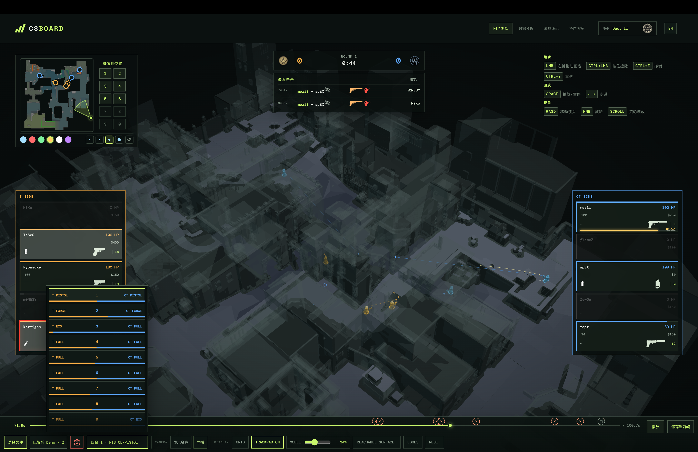
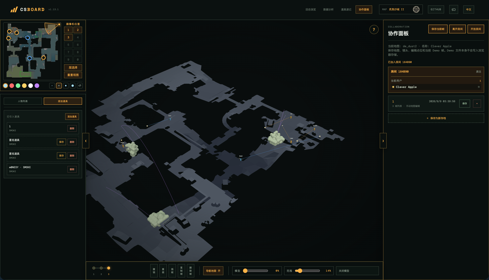
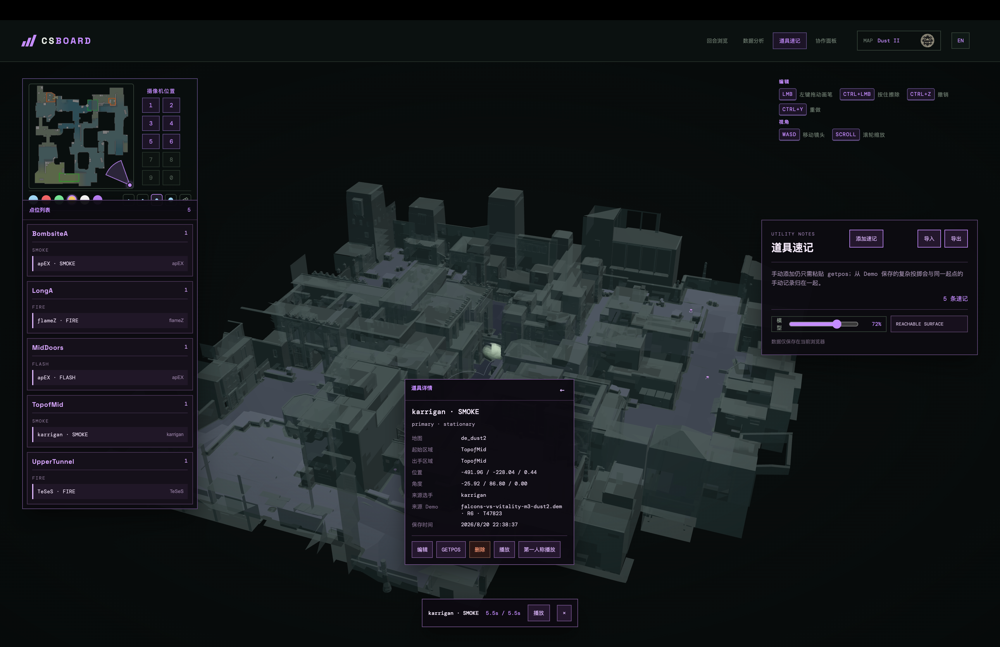
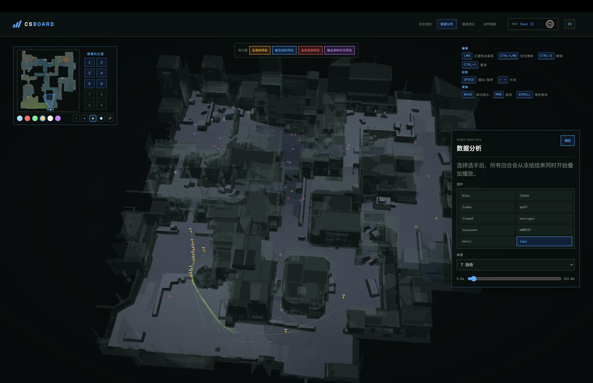
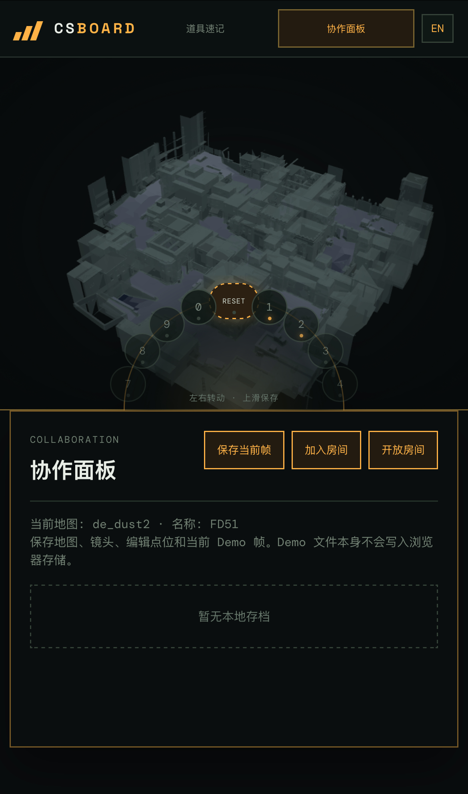

# CSBoard

> 集 3D 战术板、CS2 Demo 回放、数据分析和实时协作于一体的工具。

[English](../README.md) · [Русский](README.ru-RU.md) · [更新日志](CHANGELOG.zh-CN.md)


CSBoard 将 CS2 地图与 Demo 文件转换成可交互的战术工作区，在同一个应用中提供战术编辑、回合回放、玩家与道具可视化、事件时间轴、空间分析、本地存档以及基于 Yjs 的多人协作。

## 数据存储

Demo、分析缓存、存档、道具速记和助手会话保存在本机；本地回放、分析与编辑无需上传到服务器。多人协作和共享回放需要连接服务器，并传输共享内容。可选 AI 请求会将所用会话上下文发送给配置的服务；远程资源和更新下载也会使用网络。

## 操作助手

**实验性功能。**

在协作面板打开或新建存档，展开 **操作助手**，配置服务地址、模型和 API Key。服务需支持 Chat Completions 工具调用；本地服务允许 localhost HTTP，其余服务需 HTTPS。

AI 可以读取和编辑玩家、示意道具效果、绘制路线、战术帧、镜头和存档目录，也可打开现有保存流程。一次批量布阵对应一次撤销。房间内的编辑同步给队友，对话按独立会话长期保存在本地；停止后已完成的编辑保留。

可切换、重命名及导入导出会话，编辑长期记忆，编排步骤并限制每步允许的工具。存档、帧、功能面板和画布变化记录在本地，下次请求发送给助手。视图排除建筑模型、聚焦 NAV 地面；助手可选择局部观察的方位角和俯仰角，不改变主界面镜头。

桌面密钥由系统加密保存；网页密钥仅在内存中保留到刷新，请求经后端代理。部署时配置允许的服务地址；前后端分开部署还需允许前端来源。密钥不进入房间或导出文件。当前 NAV 没有地点名称，地图位置建议需要核对；绘制路线和手动效果不代表物理模拟。

使用支持图像输入的模型时，在设置中开启 **模型支持图像输入**。助手可查看带编号的当前、俯视和局部画布视图，并将图像像素定位到 NAV 候选。纯文本模型保持关闭，仍可查询局部多边形、高差、连接和相对位置。截图只包含画布，使用临时相机，不保留到后续对话轮次；图像识别和导入模型几何不能证明游戏内掩体、视线或道具覆盖。


## 1.20.4

- 3D 主视图显示当前 Demo 文件名。
- 支持单独移除已导入的地图模型和界面图标。
- 改善语音播放断续，降低世界模型过亮的问题。
- 详细内容见[版本记录](CHANGELOG.zh-CN.md)。

## 主要功能

### 对局回放



- 导入单个 Demo，或多选 Demo 分片并合并为一场比赛。
- 一次解析后从缓存切换回合：Go 解析器生成回放与分析数据，回合通过 IndexedDB 或 SQLite 元数据及压缩文件缓存。
- 自动忽略空的占位回合，并丢弃不兼容的旧解析缓存。
- 从冻结结束开始回放玩家移动、击杀、死亡、武器、血量、道具、C4 状态和事件标记，也可向前拖动查看冻结阶段。
- 播放 Demo 实际记录的语音并显示讲话标记；默认静音，点击顶栏声音按钮开启，竖向滑条只控制语音音量。源录像未记录语音时无法恢复；旧 Demo 缓存需重新解析。
- 使用简化的站立/蹲伏人物模型，并显示 yaw、pitch、动态视点高度和 BVH 加速的视线墙体碰撞。
- 跟踪 C4 携带、掉落、安装、爆炸、拆除、近似掉落轨迹和炸弹倒计时。
- 保存当前帧，将当前玩家和生效道具转换成可编辑的战术板对象。
- 可切换同阵营监视器墙，选择主视角；阵亡队友的画面会变黑。
- 可将命名时间段保存为本地列表中的独立自制 DEMO。

#### 自制 DEMO

支持通过 `record <名称>` / `stop` 录制的跑图和练习片段，不要求完整回合或固定人数。统一从“对局回放”导入；解析列表提示非常规对局时，点击“继续解析”。标准对局与自制录像共用本地列表、镜头、时间轴、道具效果和保存能力。自制类别左下角显示“自制DEMO”，不生成对局分析，也不显示比分、队伍状态栏和击杀栏。

#### 共享回放

- 自制录像和保存时间段共用对局回放工具，显示「自制 DEMO」，不提供对局分析与战斗状态栏。
- 点击已存片段的「分享」开放六位房间号；访客接收并保存后播放。
- 保存的是 CSBoard 回放数据，不重新生成 Source 2 `.dem` 文件；列表仅在选中时加载完整片段。

### 战术编辑



- 放置 T 或 CT 战术点（仅限协作面板）。
- 在对局回放/数据分析/道具速查面板左键拖拽绘制手绘笔迹，支持撤销与重做。
- 编辑点位阵营、符号类型、方向、视线长度和垂直倾角。
- 放置和调整烟、火、闪、HE 与诱饵弹效果。
- 在任意桌面工作区打开自定义道具轮盘，并使用 `Ctrl`/`Command` + 点击删除已放置道具。
- 每张地图保存 10 个镜头预设，并通过 `1-9` / `0` 快速恢复。
- 本地存档可保存人物、道具、画笔、镜头预设和可选的 Demo 当前帧引用。
- 本地存档可通过文件夹树拖拽整理；删除文件夹会将条目上移，不删除存档。

### 道具速记



- 可通过粘贴 `getpos` 输出或从 Demo 投掷中保存地图专属道具记录。
- 支持搜索和重播站位、视角、投掷者、事件及投掷物轨迹。
- 可直接编辑道具标题和描述。
- 支持将道具库导出为 JSON，也可将 JSON 数据附加导入本地道具库。
- 导入时按整条记录深度比较，完全相同的数据只保留一条。
- 向协作帧引入道具时，必须先选择并确认；引入道具与 `Q` 轮盘创建的自定义道具保持两套独立数据逻辑。
- 道具记录可独立按文件夹拖拽整理。

### 数据分析



- 进入数据分析页面后再懒加载分析正文、选手汇总和逐回合道具轨迹；支持按前缀、包含关系或字符顺序模糊搜索并多选选手，以彩色标签展示选中项，并明确展示加载状态。
- 从任一已选选手可用的 Demo 中选择最近或指定记录，并按全部回合、T/CT 方及每名选手自身/对方的经济类型筛选。
- 在区域时间、KD 事件和道具事件之间切换，同时保留共用的路径播放、时间进度条和步进控制。
- 区域时间可组合查看开局前期、中期和下包后；默认以冻结结束后 30 秒为前期/中期分界，也可在 10–90 秒间自行调整。
- KD 事件可分别展示击杀者、死亡者、目标和交战对手的位置。
- 道具事件可按烟、闪、火、HE 和诱饵弹筛选；位置模式显示不同形状的出手点、彩色落点与完整轨迹，热力模式只统计落点。
- 相近的道具落点保持独立，并通过 hover 列表选择；点击落点可将完整投掷记录保存到道具速记。
- 热力图按 NAV 高度分层以避免多层地图串层，并提供 2–24 米平面扩散范围调节；拖动结束后才重新计算。

### 多人协作


- 创建或加入 6 位房间号的 Yjs WebSocket 房间。
- 同步人物、引入道具、自定义道具、画笔、帧顺序和当前帧。
- 人物点带人物模型和 AK47，并使用自动生成的“形容词 + 水果”名称；可拖动移动，使用 `Ctrl` 调整 yaw、`Shift` 调整 pitch，双击切换蹲下/站立，并可在人物列表中直接选择 `T` 或 `CT` 阵营。
- 每帧包含人物、引入道具、自定义道具、轨迹和画笔；当前相机与镜头预设属于存档级数据，不属于单帧。
- 支持插帧、复制、删除、保存和切换；保存到已有存档会追加一帧，切帧时同名人物的位置、yaw 和 pitch 平滑过渡。
- 人物、道具、画笔、引入和擦除共用统一撤销/重做，并按帧隔离历史。
- 房间成员可以共同编辑战术内容，同时各自当前摄像机保持私有。
- 显示房间成员、房主/自己标记和最近加入/离开动态，并支持房主销毁房间。
- 可使用本地存档快速创建协作战术板。

### 地图渲染

- 从云存储加载受支持地图的 CS2 数据（在浏览器内解析），并限制编辑内容落在可达表面。
- 从云存储加载 GLB 地图模型并调节透明度；启用“层选择”后，模型在地图轴对齐正方形边界外 50 游戏单位开始淡出，经过 20 单位后完全透明。
- 支持鼠标透镜和镜头透视两种模型显示方式，默认使用镜头透视。
- Nuke、Train、Vertigo 与 Training Ground 支持完整、高层和低层的 NAV 顶底二值区间裁切；其他地图也可启用或取消单层可玩区间，以移除遮挡视野的屋顶模型。人物、道具、轨迹和人工编辑会遵循当前区间。
- 使用 `three-mesh-bvh` 高效查询视线最近墙体碰撞。
- 显示 GLB 下载、处理和失败状态；模型不可用时继续使用 NAV 完成镜头取景、碰撞和表面编辑。
- 直接从内置 NAV 几何生成 2D 顶视图，多层地图同步提供上下层视图。
- 支持 Blender 风格鼠标控制、触控板手势和 WASD 移动。

### 界面信息

- 运行时切换中文、英文和俄文界面。
- 查看实时 T/CT 比分、成员、血量、当前武器、剩余道具、死亡状态和 C4 携带者。
- 从时间轴直接跳转到击杀、C4 安装、爆炸和回合结束事件。
- 桌面端使用独立列放置功能面板，避免覆盖 3D 视窗，并可分别折叠可用侧栏。
- Demo 地图与当前地图不一致时，在回放控制栏提供非强制跳转提示。
- 主要纵向滚动面板和列表会在仍有内容的方向显示黑色渐变提示，到达顶部或底部后自动隐藏。

### 手机 / H5



- 原生应用与移动 H5 均采用横屏，侧栏可折叠、触控区域加大，同时支持鼠标与键盘。
- 原生应用保留完整工作区；移动 H5 仅提供道具速记与协作，不开放 Demo 导入、对局回放、数据分析及导播。
- 竖屏时显示旋转提示并暂停地图渲染。
- 空白处单指旋转镜头，双指缩放和平移；人员编辑提供移动、朝向与俯仰触控按钮。
- Android/iOS 开发预览采用 Go 原生解析与 SQLite，也可选择 WASM 解析；构建方法与当前边界见[移动端开发指南](mobile.md)。

## 支持地图

仓库内包含以下地图的文件：

- Training Ground（内置双层田字型教学地图，下层缓坡街道、上层屋顶连桥，无需外部资源）
- Ancient
- Anubis
- Cache
- Dust II
- Inferno
- Mirage
- Nuke
- Overpass
- Train
- Vertigo

所有支持地图的 NAV 解析数据均已提交并构建进前端，可离线使用。GLB 地图模型不会提交到仓库；需要本地源 `.nav` 与 `.glb` 时运行 `make resources` 下载到 `.local/official/maps/<map>/`。远程网页构建从云存储加载 GLB；本地和 Docker 使用本地模型，Electron 正式版由用户导入模型，不自动从 OSS 下载。

Training Ground 仅在道具速记和协作面板中提供；切换到对局回放或数据分析时会自动返回 Dust II。

首次访问会询问是否进入教学，确认后直接打开 Training Ground 的协作练习帧。为方便本地调试，Vite DEV 或 `localhost`、`127.0.0.1`、`::1` 环境每第 3 次访问会重复显示提醒，弹窗底部也会注明该触发条件。教学地图提供同步的上层与下层 NAV 顶视图。

## 开始使用

环境要求：

- Node.js 20 或更高版本
- npm
- GNU Make 与 Bash（Windows 使用 Git Bash，可通过 `choco install make` 安装 Make）

安装依赖：

```bash
make install
cp .env.example .env.local
```

在 `.env.local` 中填写你自己的 `VITE_OSS_BASE_URL`，然后运行 `make resources` 下载缺失的本地地图。也可以仅为下载命令设置 `MAP_DOWNLOAD_BASE_URL`；仓库不提供默认下载源。

构建前端，并通过默认 Node.js Runtime 启动 API 与协作服务：

```bash
make dev
```

默认开发命令会在 `3001` 端口启动传统 Node.js HTTP/WebSocket 适配层。需要测试 Cloudflare Workers Runtime 和 Durable Objects 集成时，使用 `make dev-workers`；该命令还会在 `3002` 端口启动本地地图服务，为前端提供 `.local/official/maps` 中的 GLB。运行 `make help` 可查看安装、资源、前端、后端和 Workers 的主要命令。

Node.js Runtime 适配层监听 `PORT`（默认 `3001`），并从 `process.env` 读取 `MAP_BASE_URL`。Cloudflare Workers 适配层使用 `env.MAP_BASE_URL` 和 Durable Object Storage；共享路由、解析和协议逻辑位于 `server/core/`。

构建生产版本：

```bash
make build
make workers-build
```

`make build` 将本地 Web 前端构建到 `dist/`；`make workers-build` 单独以 `--dry-run` 构建两个 Cloudflare Workers（含远程前端），输出到 `build/workers/`，不部署。前端构建使用 package 版本；Workers／Docker 的 Make 命令从 Git 获取版本，dirty 或无 tag 的交互构建会先询问。

`make build` 使用本地 `/maps` 和同源 API；`make build-remote` 使用 `VITE_OSS_BASE_URL` 与 `VITE_BACKEND_BASE_URL`，前端 Worker 会调用该远程构建。

Electron 正式版使用 `make desktop-build-mac-arm64` 或 `make desktop-build-win-x64` 构建，不携带地图模型。用户可从右上角“资源包”多选 SVG 图标和 GLB 模型导入，支持分批补齐及逐文件完整度检测；缺失图标沿用默认 UI，缺失模型使用 NAV 并隐藏模型操作，不自动访问 OSS。导入文件保存在应用用户数据目录，同名文件仅在验证通过后覆盖。先保存工作，再点击“重新加载并应用”。从游戏导入时会包含转换后的贴图，可在模型控件中切换「简洁模型 / 原始材质」；旧资源包需重新导入才能获得贴图。详见[资源包说明](ai/references/resource-packs.zh.md)。

未打包的开发启动可读取 `.local/official/maps`；`make desktop-prepare ARGS=--local-models` 专门构建带本地模型的测试包。正式构建不包含 `.local/official` 或 `.local/official/maps`；网页版保留现有本地/OSS 模型逻辑。

桌面页面输出到 `build/renderer/`，后台任务输出到 `build/tasks/`，Web 保持 `dist/`，两者不会互相覆盖。首次或代码更新后运行 `make desktop-prepare` 构建原生组件、页面和应用包；日常使用 `make desktop-start` 直接启动，不重复构建。`make desktop-dev` 保留未打包调试入口。

自动发布的桌面包仅保留以下两个目标。Mac 命令在 macOS 上执行，Windows 命令在 Windows 上执行：

| 目标 | 命令 | `build/desktop/` 中的产物 |
| --- | --- | --- |
| Apple Silicon | `make desktop-build-mac-arm64` | `CSBoard-<version>-mac-arm64.dmg` |
| Windows amd64 | `make desktop-build-win-x64` | `CSBoard-<version>-win-x64.exe` |

源码构建使用 Git、Node.js 和 Go。两个原生组件都使用 Go 并关闭 CGO；本地仍可使用 `make desktop-build-mac-x64` 构建 Intel Mac，Windows 使用 x64 Node.js。命令自动匹配 Go、存储组件与 Electron 架构，不自动上传；签名凭据需另行配置。

#### GitHub Actions 自动化

将 `.github/workflows/` 和版本修改一起提交到仓库。PR 与 main/master 推送会执行检查。发布时推送指向版本提交的 `v1.18.0` tag，或在 **Actions → Release → Run workflow** 填入已存在的 tag 手动运行；手动入口要求工作流已位于默认分支。tag、package／lockfile 版本和 changelog 必须一致。

Release 先校验 tag、版本、行为与网页构建，再并行构建 macOS Apple Silicon、Windows x64 和 Android。全部构建及安装包检查通过后，将三个包和 `SHA256SUMS.txt`、`SHA256SUMS-mobile.txt` 上传到同一个**草稿 Release**；不再构建 Intel Mac 和 iOS 发布包。**Mobile preview** 仅手动运行，默认 Android，也可选择 iOS 或两者，产物仅保存在 Actions，不创建 Release。版本 tag 只触发 Release。重跑只更新同一提交的草稿，不覆盖已发布版本；检查安装运行后，在 GitHub 点击 **Publish release**。

通常无需新增 Secrets 或个人 token：使用 GitHub 自带的 `GITHUB_TOKEN`，只有草稿汇总任务申请写权限。仓库需启用 Actions，仓库／组织策略需允许相关 Actions 和 Release 写入。macOS 应用及内置原生程序使用免费 ad-hoc 签名，上传前检查签名完整性；未进行 Developer ID 签名或 Apple 公证。Windows 安装包仍未签名。

`make help` 列出保留的入口。依赖安装统一用 `make install`，Workers 部署用 `make deploy`，容器管理直接用 `docker compose -f config/docker/compose.yml down`、`logs -f`、`ps`；项目命令统一由 Make 执行，图标及后台任务构建自动执行。带模型的测试包用 `make desktop-prepare ARGS=--local-models`，生成到 `build/desktop-local/`，直接打开其中的测试应用。

版本管理使用 `make version`，可选择大版本、次版本、补丁版本加一或自定义输入，自动同步各端，不创建提交或标签。移动端使用 `make mobile-prepare`、`make mobile-open`、`make mobile-build`，通过 `PLATFORM=ios|android` 指定平台，附加参数用 `ARGS="..."`。

桌面原生组件的源码构建需要 Git、Node.js 和 Go（工具链按 `native/parser/go.mod` 与 `native/storage/go.mod` 选择）；SQLite 使用纯 Go 驱动，无需 Rust/Cargo 或 C 编译器。安装后的应用自带可执行文件，无需安装 Go 或 Python。原生数据位于 Electron 用户数据目录的 `native-data/`，旧 IndexedDB 数据按需复制，保留原数据库；浏览器偏好仍留在浏览器存储中。升级前建议备份重要存档。

桌面端解析共享可用逻辑核心，最多同时解析两份 Demo；低内存设备或内存压力下自动串行，并设置解析器垃圾回收的软内存目标。其余导入项排队等待。实体、事件及烟火状态保持顺序处理。“桌面管理 → 存储与备份”保留即时分析开关，默认复用分析缓存。

“桌面管理 → 显示”提供 80%–150% 界面字号调整，自动保存，可恢复默认。

右上角“桌面管理”可查看空间占用、按最近使用清理 Demo 缓存、创建和恢复备份，以及查看或取消后台任务。备份包含原生存档、Demo 缓存和导入资源，不包含原始 `.dem`、浏览器偏好及未保存内容。恢复重启后生效，恢复前的数据保留在数据目录的 `restores` 文件夹。可为本次运行开启任务期间防自动休眠；窗口最小化时暂停 3D 绘制，后台解析继续。


通过 Docker 运行 Node.js Runtime 时，将 GLB 放到 `.local/official/maps/<map>/` 后执行 `make docker`。Compose 会把该目录只读挂载到 `/app/.local/official/maps`；只有需要覆盖镜像默认的 `v1.18.0` 版本时才需设置 `BUILD_VERSION`。

## 操作方式

| 输入 | 操作 |
| --- | --- |
| 中键拖动 | 旋转镜头 |
| `Shift` + 中键 | 平移镜头，指针越过视口边缘时像 Blender 一样从反侧出现 |
| 鼠标滚轮 / 触控板手势 | 缩放或环绕 |
| `W A S D` | 移动镜头 |
| 左键拖拽（对局回放/数据分析/道具速查） | 在地面绘制手绘笔迹 |
| `Ctrl+Z` / `Ctrl+Shift+Z` / `Ctrl+Y` | 撤销 / 重做画笔笔迹 |
| `E` | 放置战术点（仅协作面板） |
| `Ctrl` + 左键拖动 | 擦除画笔笔迹，或调整人物 yaw |
| `Ctrl` / `Command` + 点击已放置道具 | 删除该道具 |
| `Shift` + 左键拖动人物 | 调整人物 pitch |
| `Q` | 在当前桌面工作区打开自定义道具轮盘 |
| 左键点击点位 | 打开点位编辑器 |
| `Ctrl` + `1-9` / `0` | 保存 10 个镜头预设之一 |
| `1-9` / `0` | 恢复镜头预设 |
| `Space` | 播放或暂停回放/分析 |
| `←` / `→` | 回放或分析步进 16 ticks；切换相邻协作帧 |
| 手机单指拖动 | 旋转镜头 |
| 手机双指手势 | 缩放并平移镜头 |
| 手机机位轮盘滑动 | 循环选择机位；上滑保存中心机位 |

## 资源结构

AI 提示词与参考资料位于 [docs/ai](ai/README.md)，预设数据独立位于 [docs/presets](presets/README.md)。

```text
assets/
  readme/                 # README 截图与演示 GIF
src/
  data/nav/               # 由脚本生成并提交、由 Vite 构建的 NAV JSON
docs/
  ai/                     # AI 提示词与参考资料
    prompts/
    references/
  presets/                # 预设数据
    utility-notes/        # 道具速记 JSON
    workspace-archives/   # 协作面板存档 JSON
.local/
  official/               # 游戏来源素材，包含提取与转换后的资源
    maps/<map>/           # NAV 源文件和 GLB 模型
    ui/                   # 资源包测试 SVG
    vpk/                  # 原始归档与解包输出
  dem/                    # 按平台分类的 Demo 样本
  previews/               # 生成的预览和本地检查
```

贡献者可将默认道具速记或协作存档 JSON 直接放入 `docs/presets/` 对应子目录，具体格式见 [`docs/presets/README.md`](presets/README.md)。这些文件只会在浏览器从未创建对应本地数据时导入，不会覆盖或重新填充现有用户数据。

运行 `make resources` 时，`scripts/ensure-maps.js` 会检测本地地图源文件与模型，并从 `.env.local` 的 `VITE_OSS_BASE_URL`（或 `MAP_DOWNLOAD_BASE_URL`）下载缺失文件。未配置下载源时命令会明确报错。替换源 NAV 后，运行 `make nav-data` 重新生成需要提交的前端数据。

NAV JSON 会直接包含在前端 bundle 中，并只在选中对应地图时解析；浏览器不会在运行时请求 NAV。本地构建通过 `/maps/<map>/<map>.glb` 从 `.local/official/maps` 加载 GLB，远程构建使用：

- `<VITE_OSS_BASE_URL>/maps/<map>/<map>.glb`

GLB 存储桶需返回 `Access-Control-Allow-Origin` 头。`src/navParser.js` 仅保留给构建期 NAV 生成脚本使用，不再暴露运行时解析接口。

地图导出工具和原始游戏资源继续仅保存在本地。请勿提交 VPK、解包后的游戏资源、Demo 文件或 GLB 模型。

## 技术架构


- React 与 Vite：应用外壳和界面。
- `src/analysis/` 收纳分析组件与计算逻辑，`src/demo/` 放置 Demo 领域逻辑和 HUD，`src/components/` 放置共享 UI，`src/three/` 放置 Three.js 辅助模块，`src/utility/` 放置道具速记逻辑，`src/hooks/` 放置跨面板 DOM 行为。
- Three.js：地图、战术对象、效果和回放渲染。
- 固定提交的 `dlwm/demoinfocs` fork 与 `native/parser/` 适配层：解析 Demo 事件、Tick、玩家、库存及投掷物，构建为 Go WASM 和原生可执行文件。
- `src/platform/` 选择浏览器或桌面服务；桌面后台进程处理重计算，SQLite 与压缩文件保存数据。
- `three-mesh-bvh`：地图射线检测加速。
- Yjs 与 `y-websocket`：协作房间协议。
- Node.js Runtime：传统 HTTP/WebSocket 服务入口。
- Cloudflare Workers Fetch API：后端 Worker 提供 HTTP 路由，前端 Worker 提供静态资源。
- Durable Objects：云端房间 WebSocket 与短期 Yjs 持久化。

## Cloudflare Workers 部署

在项目根目录执行：

```sh
make dev-workers                # 本地 Workers 开发
make deploy ARGS=--dry-run        # 仅构建，不发布
make deploy                    # 登录并部署
```

部署复用 Wrangler OAuth，未登录时打开浏览器授权。在被忽略的 `config/cloudflare/deploy.env` 中可选配置前后端域名；根域名托管在所选账户时，Cloudflare 自动管理 DNS 与证书。脚本发布两个 Worker，通过健康与前端资源检查后输出访问地址。

地图资源、域名、CI 凭据、AI 服务允许列表与可选 UI 图标的配置统一见 [Cloudflare 部署指南](../config/cloudflare/README.md)。Workers 仍有内存与 CPU 限制，大型 Demo 应在本地解析。

## 许可证

Copyright (C) 2026 Colvin Chen。CSBoard 原创源代码与文档采用 [GNU GPL v3.0 only](../LICENSE)；对外分发的修改版本必须继续使用 GPLv3，并提供对应源代码。第三方库和资源仍分别遵循自己的许可证，准确范围见 [许可范围](THIRD_PARTY_NOTICES.md#licensing-scope)。

## 当前限制

- Node.js Runtime 的协作房间保存在进程内存中；Cloudflare Workers 使用 Durable Object Storage，并在最后一个客户端离开五分钟后清理。
- 房主身份目前主要由客户端管理，尚未使用服务端签发的 owner token。
- 解析器没有暴露 C4 实体逐 Tick 坐标，因此掉落轨迹只能根据事件近似。
- 生产环境仍依赖云存储提供 GLB 模型；模型或网络不可用时，前端内置 NAV 几何仍可正常使用。
- Demo 初次解析后会缓存全部回合，大型 Demo 可能占用较多内存。
- 对局回放和数据分析在桌面浏览器及原生应用中提供；移动 H5 提供道具速记与协作。

## 未来方向

### 模型尺寸缩减

- 缩减地图模型资源体积、下载开销和运行时内存占用。

HTTP 解析接口及离线分析工具也使用生成的 Go WASM；请求结束释放解析会话，同一运行实例串行处理。Cloudflare 的 CPU、内存及包体限制仍然适用。
